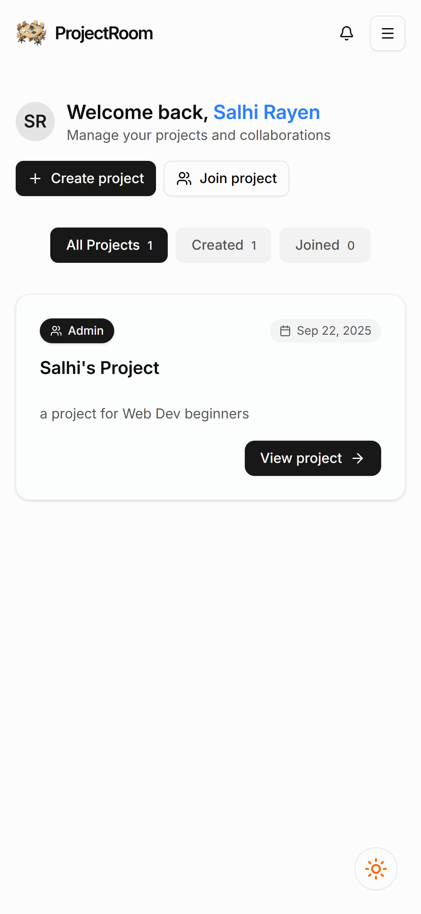

# ProjectRoom - Team Collaboration Platform

A modern React-based project management platform built for teams, students, and startups to organize projects, track tasks, and collaborate effectively. ProjectRoom provides a comprehensive suite of tools for project management, team collaboration, and progress tracking.

## 🎯 Project Overview

ProjectRoom is designed to streamline team collaboration and project management through an intuitive, feature-rich platform. The application addresses common pain points in team coordination by providing:

- **Centralized Project Management**: Organize all your team's projects in one accessible location
- **Intelligent Task Assignment**: AI-powered task generation and smart assignment capabilities
- **Real-time Collaboration**: Live updates and notifications keep teams synchronized
- **Progress Visualization**: Comprehensive charts and statistics for project monitoring
- **Flexible Access Control**: Role-based permissions ensuring appropriate access levels
- **Modern User Experience**: Clean, responsive design with dark/light theme support

The platform serves as a complete solution for teams looking to improve their project workflow, from initial project creation through task completion and progress tracking.

## 📸 Visual Showcase

### Landing & Authentication
<div align="center">
  <table>
    <tr>
      <td align="center">
        
        <br />
        <em>Modern landing page with hero section and feature highlights</em>
      </td>
      <td align="center">
        
        <br />
        <em>Home page in dark mode showing theme consistency</em>
      </td>
    </tr>
    <tr>
      <td align="center">
        
        <br />
        <em>Clean and intuitive login interface</em>
      </td>
      <td align="center">
        
        <br />
        <em>User registration with validation and error handling</em>
      </td>
    </tr>
  </table>
</div>

### Dashboard & Project Management
<div align="center">
  <table>
    <tr>
      <td align="center">
        
        <br />
        <em>User dashboard showing all projects with filtering capabilities</em>
      </td>
      <td align="center">
        
        <br />
        <em>Project creation dialog with auto-generated invite codes</em>
      </td>
    </tr>
    <tr>
      <td align="center">
        
        <br />
        <em>Join existing projects using secure invite codes</em>
      </td>
      <td align="center">
        
        <br />
        <em>Project overview with member management and settings</em>
      </td>
    </tr>
  </table>
</div>

### Task Management & Assignment
<div align="center">
  <table>
    <tr>
      <td align="center">
        
        <br />
        <em>AI-powered task generation from project descriptions</em>
      </td>
      <td align="center">
        
        <br />
        <em>Intuitive drag-and-drop task assignment interface</em>
      </td>
    </tr>
    <tr>
      <td align="center">
        
        <br />
        <em>Visual task assignment with member avatars and status indicators</em>
      </td>
      <td align="center">
        
        <br />
        <em>Color-coded deadline management with urgency indicators</em>
      </td>
    </tr>
  </table>
</div>

### Progress Tracking & Analytics
<div align="center">
  <table>
    <tr>
      <td align="center">
        
        <br />
        <em>Comprehensive progress dashboard with task statistics</em>
      </td>
      <td align="center">
        
        <br />
        <em>Task completion analytics with visual bar charts</em>
      </td>
    </tr>
    <tr>
      <td align="center">
        
        <br />
        <em>Task distribution visualization with interactive pie charts</em>
      </td>
      <td align="center">
        
        <br />
        <em>Analytics dashboard seamlessly adapted for dark mode</em>
      </td>
    </tr>
  </table>
</div>

### Notifications & Communication
<div align="center">
  <table>
    <tr>
      <td align="center">
        
        <br />
        <em>Centralized notification center with task assignments and deadlines</em>
      </td>
      <td align="center">
        
        <br />
        <em>Detailed notification view with direct links to tasks</em>
      </td>
    </tr>
    <tr>
      <td align="center">
        
        <br />
        <em>Smart notification bell with unread count and urgency indicators</em>
      </td>
      <td align="center">
        
        <br />
        <em>Activity timeline showing all project updates and member activities</em>
      </td>
    </tr>
  </table>
</div>

### Task Submission & Review
<div align="center">
  <table>
    <tr>
      <td align="center">
        
        <br />
        <em>Structured task submission form with file upload capabilities</em>
      </td>
      <td align="center">
        
        <br />
        <em>Submission management interface for reviewing team submissions</em>
      </td>
    </tr>
    <tr>
      <td align="center">
        
        <br />
        <em>Detailed submission review with approval/rejection capabilities</em>
      </td>
      <td align="center">
        
        <br />
        <em>Drag-and-drop file upload with progress indicators</em>
      </td>
    </tr>
  </table>
</div>

### Mobile & Responsive Design
<div align="center">
  <table>
    <tr>
      <td align="center">
        
        <br />
        <em>Fully responsive mobile interface with touch-friendly interactions</em>
      </td>
      <td align="center">
        
        <br />
        <em>Optimized mobile navigation with collapsible menu</em>
      </td>
    </tr>
    <tr>
      <td align="center">
        
        <br />
        <em>Member view dashboard with limited but focused functionality</em>
      </td>
      <td align="center">
        
        <br />
        <em>About page showcasing platform features and capabilities</em>
      </td>
    </tr>
  </table>
</div>

### Dark Mode Implementation
<div align="center">
  <table>
    <tr>
      <td align="center">
        
        <br />
        <em>Dashboard filters and search in dark mode</em>
      </td>
      <td align="center">
        
        <br />
        <em>Team member management interface in dark theme</em>
      </td>
    </tr>
    <tr>
      <td align="center">
        
        <br />
        <em>Project activity timeline with consistent dark mode styling</em>
      </td>
      <td align="center">
        
        <br />
        <em>Progress analytics maintaining readability in dark mode</em>
      </td>
    </tr>
  </table>
</div>

## 🚀 Technologies Used

### Frontend Framework & Core Technologies
**React Ecosystem:**
• **React 19.1.1** - Latest version with improved performance and concurrent features
• **TypeScript 5.8.3** - Full type safety with strict mode enabled
• **Vite 7.1.6** - Ultra-fast build tool with HMR and optimized production builds
• **React Router DOM 7.9.1** - Declarative routing with nested routes and data loading

### UI/UX Design System
**Styling & Components:**
• **Tailwind CSS 4.1.13** - Utility-first CSS framework for rapid UI development
• **shadcn/ui** - Modern, accessible component library with customizable themes
• **Radix UI Primitives** - Unstyled, accessible components including:
  - Avatar, Dialog, Dropdown Menu, Label, Popover
  - ScrollArea, Select, Slot for advanced component composition
• **Lucide React 0.544.0** - Beautiful, consistent icon library
• **next-themes 0.4.6** - Seamless light/dark theme switching with system preference detection

### Interactive Features & Animations
**User Interactions:**
• **@dnd-kit** - Complete drag-and-drop ecosystem:
  - Core: Foundation for drag-and-drop interactions
  - Sortable: Sortable lists and grids
  - Utilities: Helper functions and accessibility features
• **Sonner 2.0.7** - Elegant toast notifications with promise handling

### Data Visualization & Analytics
**Charts & Graphs:**
• **Recharts 3.2.1** - Composable charting library with React components
• Custom chart components for task statistics and progress tracking
• Responsive design that adapts to different screen sizes

### Backend & Data Management
**Database & Authentication:**
• **Supabase 2.57.4** - Complete backend solution providing:
  - PostgreSQL database with real-time subscriptions
  - Authentication with multiple providers (email/password, OAuth)
  - Row-level security and database policies
  - File storage and CDN integration
  - Edge functions for serverless computing

### AI Integration
**Intelligent Features:**
• **OpenAI API 6.1.0** - Advanced AI capabilities for:
  - Task generation from project descriptions
  - Smart task categorization and prioritization
  - Natural language processing for user inputs
• Environment-based configuration for secure API key management

### Security & Data Protection
**Security Measures:**
• **DOMPurify 3.2.7** - XSS protection and HTML sanitization
• **Environment Variables** - Secure configuration management
• **Input Validation** - Comprehensive form validation with custom rules
• **TypeScript Strict Mode** - Compile-time error detection and type safety

### Development & Build Tools
**Development Experience:**
• **ESLint 9.35.0** - Code linting with React-specific rules
• **TypeScript ESLint** - Type-aware linting for better code quality
• **@vitejs/plugin-react** - React fast refresh and JSX transform
• **Path Aliases** - Clean imports with `@/` prefix for better organization

### Utility Libraries
**Helper Functions:**
• **date-fns 4.1.0** - Modern date utility library for parsing, formatting, and manipulation
• **clsx & tailwind-merge** - Conditional className utility with Tailwind CSS support
• **class-variance-authority 0.7.1** - Type-safe component variants and styling

## 🔧 Main Functionalities

### Authentication & User Management
**How it works:** Users create accounts with full name, email, and password validation. The system implements secure authentication using Supabase Auth with JWT tokens and automatic session management.

• **User Registration**: Complete signup with full name, email, and password validation
• **Secure Login**: Email/password authentication with session management
• **Protected Routes**: Route-level authentication protection
• **User Profiles**: Personalized user profiles with role-based access
• **Session Management**: Automatic token handling and persistent sessions

### Project Management
**How it works:** Users can create projects with auto-generated invite codes or join existing projects. Each project has a dedicated workspace with role-based access control.

• **Create Projects**: Users can create new projects with names, descriptions, and auto-generated invite codes
• **Join Projects**: Join existing projects using secure invite codes
• **Project Dashboard**: Visual grid layout showing all user projects with filtering options
• **Role-Based Access**: Admin and collaborator roles with visual indicators
• **Project Timeline**: Activity feed showing project updates and member activities
• **Project Settings**: Manage project details and team membership

### 🎯 Task Management
**How it works:** Admins can create tasks manually or use AI to generate tasks from project descriptions. Tasks are assigned via drag-and-drop interface with real-time status tracking and deadline management.

• **AI-Powered Task Generation**: Generate tasks from project descriptions using OpenAI
• **Drag-and-Drop Interface**: Intuitive task assignment with visual feedback using DnD Kit
• **Task Assignment**: Assign tasks to team members with status tracking
• **Task Timeline**: Track task creation, updates, and completion
• **Task Filtering**: Filter tasks by status, assignee, or deadline urgency (all, overdue, due today)
• **Role-Based Task Access**: Admins can create and assign tasks, members have read-only access
• **Task Status Tracking**: Visual indicators for finished vs in-progress tasks (To Do, In Progress, Completed, Overdue)
• **Deadline Management**: Color-coded urgency indicators and overdue task highlighting
• **Statistics Dashboard**: Real-time task completion rates and progress visualization

### Team Collaboration
**How it works:** Team members can view project progress, receive notifications for assigned tasks, and collaborate through the centralized platform with real-time updates.

• **Member Management**: Add/remove team members and manage roles
• **Real-time Updates**: Live project timeline with member activities
• **Progress Tracking**: Visual progress indicators and status updates
• **Notification System**: Comprehensive task assignment notifications with deadline tracking
• **Task Submission Workflow**: Structured notification-to-submission process for assigned tasks

### 🔔 Notification System
**How it works:** The system automatically generates notifications when tasks are assigned or deadlines approach. Users can access a centralized notification center with direct links to relevant tasks.

• **Task Assignment Notifications**: Automatic notifications when tasks are assigned
• **Deadline Reminders**: Urgency-based notifications for approaching deadlines
• **Notification Center**: Centralized view of all notifications with detailed information
• **Status Tracking**: Notifications include task details, deadlines, and project context
• **Direct Links**: Quick navigation from notifications to task submission forms

### 📤 Task Submission Workflow
**How it works:** Users receive notifications about assigned tasks, view task details, and submit their work through a structured submission process. The system supports file uploads and tracks submission status.

• **Structured Process**: Notification → Task Details → Submission Form workflow
• **File Upload Support**: Upload documents, images, and other file types
• **Submission Tracking**: Monitor submission status and review feedback
• **Admin Review**: Project admins can review and approve/reject submissions
• **Progress Monitoring**: Track submission history and completion rates

### User Interface & Experience
**How it works:** The application features a modern, responsive design with consistent UI components, smooth animations, and intuitive navigation across all devices.

• **Responsive Design**: Mobile-first, fully responsive interface
• **Modern UI Components**: Consistent design system with shadcn/ui
• **Loading States**: Skeleton loaders and spinners for better UX
• **Error Handling**: Graceful error boundaries and user-friendly messages
• **Theme Support**: Light and dark mode with system preference detection

### Security & Data Protection
**How it works:** The platform implements comprehensive security measures including input sanitization, secure authentication, and data validation to protect user information.

• **Input Sanitization**: DOMPurify integration for XSS protection
• **Form Validation**: Comprehensive validation with custom rules
• **Environment Variables**: Secure configuration management
• **TypeScript**: Type-safe development with strict mode

## 🛠️ Installation

### Prerequisites
• Node.js (v18 or higher)
• npm or yarn package manager
• Git for version control

### Setup Instructions

1. **Clone the repository**
```bash
git clone <repository-url>
cd my-project
```

2. **Install dependencies**
```bash
npm install
```

3. **Environment Configuration**
Create a `.env` file in the root directory with the following variables:

```env
# Required Environment Variables
VITE_SUPABASE_URL=your_supabase_project_url
VITE_SUPABASE_API_KEY=your_supabase_anon_key
VITE_OPENAI_API_KEY=your_openai_api_key
VITE_BASE_URL=your_openai_base_url

4. **Start Development Server**
```bash
npm run dev
```

The application will be available at `http://localhost:5173`

## 🤝 Contributing

We welcome contributions to ProjectRoom! Here's how you can help:

1. **Fork the repository** and create your feature branch
2. **Follow the coding standards** established in the project
3. **Write tests** for new features and ensure all tests pass
4. **Update documentation** for any new functionality
5. **Submit a pull request** with a clear description of changes

### Development Guidelines
- Use TypeScript strict mode for type safety
- Follow the established component structure and naming conventions
- Implement proper error handling and user feedback
- Ensure responsive design for all screen sizes
- Test both light and dark themes
- Validate forms and sanitize user inputs

## 📝 License

This project is licensed under the MIT License - see the [LICENSE](LICENSE) file for details.

## 🙏 Acknowledgments

- **shadcn/ui** for the excellent component library
- **Supabase** for the powerful backend services
- **OpenAI** for AI-powered task generation capabilities
- **React Community** for the amazing ecosystem of tools and libraries
- **Contributors** who have helped improve this project

## 📞 Support

If you encounter any issues or have questions:

1. **Check the documentation** in this README
2. **Search existing issues** in the repository
3. **Create a new issue** with detailed information
4. **Include screenshots** and error messages when applicable

## 🚀 Future Roadmap

- **Enhanced AI Features**: More sophisticated task generation and project planning
- **Mobile App**: Native mobile applications for iOS and Android
- **Advanced Analytics**: Detailed project insights and team performance metrics
- **Integration Hub**: Connect with popular tools like Slack, GitHub, and Google Workspace
- **Custom Workflows**: Configurable project templates and automation rules
- **Team Communication**: Built-in messaging and video conferencing features

## 🎯 Key Features & Value Proposition

### For Project Managers
- **Comprehensive Project Oversight**: Complete visibility into all project aspects from a single dashboard
- **AI-Assisted Planning**: Leverage OpenAI to generate structured tasks from project descriptions
- **Real-time Progress Tracking**: Live updates on task completion and team performance
- **Data-Driven Decisions**: Visual analytics and reports for informed project management

### For Team Members
- **Clear Task Assignment**: Intuitive interface showing assigned tasks with deadlines and priorities
- **Seamless Collaboration**: Easy communication through notifications and project timelines
- **Progress Visibility**: Transparent view of project status and individual contributions
- **Mobile Accessibility**: Full functionality on mobile devices for on-the-go productivity

### For Teams & Organizations
- **Scalable Architecture**: Handles multiple projects and team members efficiently
- **Role-Based Security**: Appropriate access levels for different team roles
- **Integration Ready**: Built with modern APIs for future integrations
- **Cost-Effective**: Open-source technology stack reducing licensing costs

## 📁 Project Structure

```
src/
├── components/          # Reusable UI components
│   ├── ui/            # shadcn/ui base components (Button, Card, Dialog, etc.)
│   ├── dialogs/       # Modal dialogs
│   │   ├── CreateProjectDialog.tsx
│   │   ├── JoinProjectDialog.tsx
│   │   └── GenerateTasksDialog.tsx
│   ├── charts/        # Data visualization components
│   ├── Navbar.tsx     # Navigation component with theme toggle
│   ├── Protected.tsx  # Authentication wrapper
│   ├── TasksProtected.tsx # Role-based task access control
│   ├── ErrorBoundary.tsx # Error handling
│   ├── EmptyState.tsx # Empty state UI
│   ├── Spinner.tsx    # Loading indicators
│   ├── SuspenseWrapper.tsx # Lazy loading wrapper
│   └── ...
├── pages/             # Route components
│   ├── Home.tsx       # Landing page
│   ├── About.tsx      # About page
│   ├── Signin.tsx     # Login page
│   ├── Signup.tsx     # Registration page
│   ├── Dashboard.tsx  # User dashboard with project grid
│   ├── Profile.tsx    # User profile management
│   ├── Notification.tsx # Individual notification details
│   ├── Notifications.tsx # All notifications list
│   ├── TaskSubmission.tsx # Task submission form (under development)
│   └── project/       # Project-specific pages
│       ├── Timeline.tsx    # Project activity feed
│       ├── Members.tsx     # Team management
│       ├── ProjectInfo.tsx # Project details
│       ├── Progress.tsx    # Progress tracking with charts
│       ├── Tasks.tsx       # Admin task management
│       ├── TasksReadOnly.tsx # Member task view
│       ├── progress/       # Progress subcomponents
│       │   ├── BarChart.tsx
│       │   ├── Pie.tsx
│       │   ├── Stats.tsx
│       │   └── types.ts
│       └── tasks/          # Task management subcomponents
│           ├── AssignmentStep.tsx
│           ├── CreateTasksStep.tsx
│           ├── SortableTaskItem.tsx
│           ├── types.ts
│           └── utils.ts
├── context/           # React contexts
│   ├── AuthContext.tsx    # Authentication state and notifications
│   └── ThemeContext.tsx   # Theme management
├── layout/            # Layout components
│   ├── DashboardLayout.tsx # Dashboard wrapper
│   └── ProjectLayout.tsx   # Project wrapper with data fetching
├── hooks/             # Custom React hooks
│   └── useTimeline.ts # Timeline data fetching
├── services/          # External service integrations
│   └── aiService.ts # OpenAI API integration
├── lib/               # Utility libraries
│   └── utils.ts     # Helper functions
└── utils.ts         # Application utilities (validation, formatting, etc.)
```

## 🔧 Configuration

### TypeScript Configuration
• Strict mode enabled for type safety
• Path aliases configured (`@/` maps to `./src/`)
• Separate configurations for app and node environments

### Vite Configuration
• React plugin with fast refresh
• Tailwind CSS integration
• Path resolution for clean imports
• Optimized build process

### Tailwind CSS Configuration
• Utility-first CSS framework
• Custom color schemes and themes
• Responsive design utilities
• Component-specific styling

## 🎯 Usage Examples

### Creating a New Project
1. Navigate to the dashboard after logging in
2. Click "Create Project" button
3. Fill in project name and description
4. Project will be created with auto-generated invite code

### Joining an Existing Project
1. Click "Join Project" button on dashboard
2. Enter the invite code provided by project admin
3. You'll be added as a collaborator

### Generating Tasks with AI
1. Navigate to a project
2. Click "Generate Tasks" button
3. Enter project description
4. AI will generate relevant tasks for your project

### Managing Team Members
1. Go to project settings
2. Navigate to "Members" tab
3. View current members and their roles
4. Use invite codes to add new members

## 🔒 Environment Variables

The application requires the following environment variables:

| Variable | Description | Required |
|----------|-------------|----------|
| VITE_SUPABASE_URL | Supabase project URL | Yes |
| VITE_SUPABASE_API_KEY | Supabase anon key | Yes |
| VITE_OPENAI_API_KEY | OpenAI API key | Yes |
| VITE_BASE_URL | OpenAI base URL | Yes |

## 📝 Task Submission Workflow

### Current Implementation
The task submission system provides a structured workflow for team members to complete assigned tasks:

1. **Notification Receipt**: Users receive task assignment notifications with details including:
   - Task title and description
   - Project context
   - Assigned by information
   - Deadline with urgency indicators (color-coded)
   - Creation timestamp

2. **Notification Details**: Users can view comprehensive task information with:
   - Visual deadline urgency indicators (red/orange/yellow/green)
   - Project and admin context
   - Direct navigation to submission form

3. **Submission Process**: Users proceed to task submission via dedicated route

### Next Steps for Task Submission Implementation

#### User Submission Workflow
- **File Upload System**: Implement drag-and-drop file upload with multiple format support
- **Submission Form**: Create comprehensive form with:
  - Task completion description
  - File attachments (documents, images, code files)
  - Completion confirmation checkbox
  - Optional notes/comments field
- **Validation**: Implement client-side validation for required fields
- **Progress Indicators**: Add upload progress bars and form validation states

#### Admin Review Process
- **Submission Dashboard**: Admin interface to review all pending submissions
- **Review Criteria**:
  - Task completion verification against original requirements
  - File/document quality assessment
  - Deadline compliance checking
  - Optional feedback/comment system
- **Decision Actions**:
  - **Accept**: Mark task as completed, update project progress
  - **Reject**: Return task with feedback, reset to in_progress status
  - **Request Changes**: Partial approval with modification requests

#### Status Transitions
- **Successful Submission Flow**:
  1. User submits completed task
  2. Admin receives notification of new submission
  3. Admin reviews and accepts/rejects
  4. Task status updates to "finished" or remains "in_progress"
  5. Project progress recalculates automatically

- **Rejection Scenarios**:
  - **Incomplete Work**: Missing required deliverables
  - **Quality Issues**: Substandard work quality
  - **Deadline Issues**: Late submissions requiring special handling
  - **Technical Issues**: File corruption or format problems

- **Automatic Status Updates**:
  - Tasks marked as "finished" upon admin acceptance
  - Tasks remain "in_progress" if rejected or requiring changes
  - Deadline extensions handled through admin interface
  - Progress metrics update in real-time
## 🧪 Available Scripts

| Script | Description |
|--------|-------------|
| `npm run dev` | Start development server with hot reload |
| `npm run build` | Build for production with TypeScript compilation |
| `npm run lint` | Run ESLint for code quality checks |
| `npm run preview` | Preview production build locally |

## 🤝 Contributing

### Development Guidelines
1. Follow TypeScript best practices and maintain type safety
2. Use the established component patterns and design system
3. Write clear, descriptive commit messages
4. Test your changes across different screen sizes
5. Ensure all form inputs are properly validated and sanitized

### Code Style
• Use TypeScript strict mode
• Follow the established component structure
• Maintain consistent naming conventions
• Use the provided utility functions for common operations
• Implement proper error handling

### Pull Request Process
1. Fork the repository
2. Create a feature branch (`git checkout -b feature/amazing-feature`)
3. Commit your changes (`git commit -m 'Add amazing feature'`)
4. Push to the branch (`git push origin feature/amazing-feature`)
5. Open a Pull Request with detailed description

## 🚀 Next Steps: Task Submission Implementation

### Current Status
The task submission system is partially implemented with:
- ✅ Notification system for task assignments
- ✅ Task details view with deadline tracking
- ⚠️ Basic submission form structure (under development)
- ❌ File upload functionality
- ❌ Admin review workflow

### Implementation Plan

#### 1. User Submission Workflow
**Phase 1: Core Submission Features**
- **File Upload System**: Multi-file upload with drag-and-drop support
- **Rich Text Editor**: Description field with formatting options
- **Validation**: Required fields, file type/size validation, deadline checks
- **Progress Indicators**: Upload progress, form validation states
- **Auto-save**: Draft preservation during submission process

**Phase 2: Enhanced User Experience**
- **Submission History**: Track all user submissions with timestamps
- **Resubmission**: Allow updates before deadline
- **Preview Mode**: Review submission before finalizing
- **Confirmation**: Success/error notifications with clear feedback

#### 2. Admin Review Process

**Review Dashboard**
- **Submission Queue**: Filterable list of pending submissions
- **Quick Actions**: Accept/Reject with reason codes
- **Bulk Operations**: Process multiple submissions efficiently
- **Review History**: Track admin decisions and feedback

**Acceptance Criteria**
- **Quality Standards**: Check for completeness and accuracy
- **Deadline Compliance**: Ensure submissions meet deadlines
- **File Validation**: Verify file formats and content
- **Requirements Met**: Confirm all task requirements are addressed

**Rejection Scenarios**
- **Incomplete Submissions**: Missing required elements
- **Late Submissions**: Past deadline submissions
- **Quality Issues**: Poor quality or incorrect content
- **Technical Problems**: File corruption or format issues
- **Resubmission Requests**: Allow users to address feedback

#### 3. Status Transitions

**Task Status Flow**
```
assigned → in_progress → submitted → reviewed → finished
                    ↓           ↓
                overdue    rejected → in_progress (resubmission)
```

**Status Management**
- **Automatic Updates**: Status changes based on deadlines and actions
- **Manual Overrides**: Admins can adjust statuses when needed
- **History Tracking**: Log all status changes with reasons
- **Notifications**: Alert users and admins of status changes

**Completion Logic**
- **Successful Submission**: Task marked as finished after acceptance
- **Rejection Handling**: Task returns to in_progress with feedback
- **Deadline Management**: Automatic overdue status updates
- **Completion Rates**: Track and display project completion statistics

### Technical Implementation
- **Database Schema**: Extend tasks table with submission fields
- **File Storage**: Supabase storage for submission files
- **API Endpoints**: New endpoints for submission and review operations
- **Real-time Updates**: Live status updates using Supabase subscriptions
- **Security**: File upload validation, access control, data sanitization

### Supabase Integration
The application uses Supabase for:
• User authentication and session management
• Project and task data storage
• Real-time subscriptions for live updates
• User profile management

### OpenAI Integration
AI-powered features include:
• Task generation from project descriptions
• Natural language processing for project planning
• Automated task suggestions based on project context

## 🐛 Troubleshooting

### Common Issues

**Build Errors**
• Ensure all dependencies are installed: `npm install`
• Check TypeScript configuration files
• Verify environment variables are properly set

**Authentication Issues**
• Verify Supabase credentials in environment variables
• Check network connectivity to Supabase
• Ensure user has proper permissions

**AI Service Issues**
• Verify OpenAI API key is valid
• Check API rate limits and usage
• Ensure base URL is correctly configured

## 📄 License

This project is licensed under the MIT License - see the [LICENSE](LICENSE) file for details.

## 🙏 Acknowledgments

• Built with modern React ecosystem tools
• UI components powered by shadcn/ui and Radix UI
• Icons from Lucide React
• Styling with Tailwind CSS
• Backend services powered by Supabase
• AI capabilities powered by OpenAI